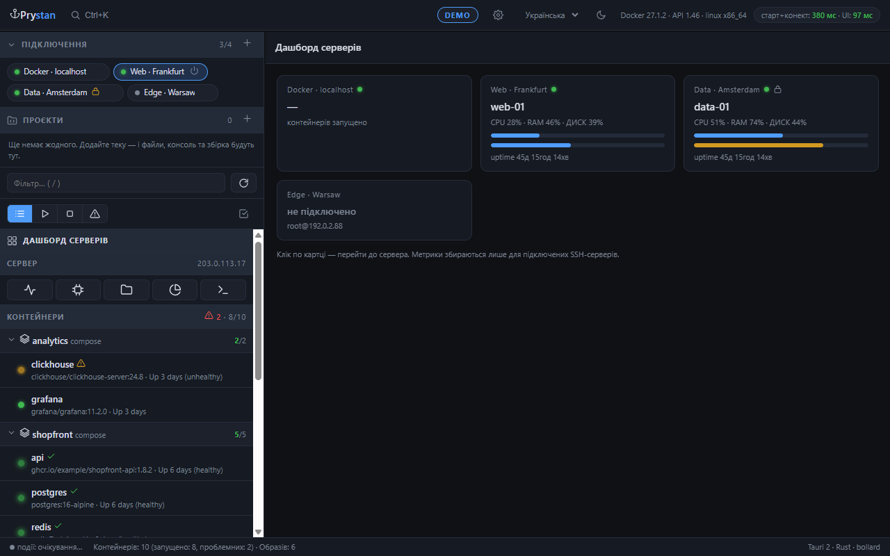
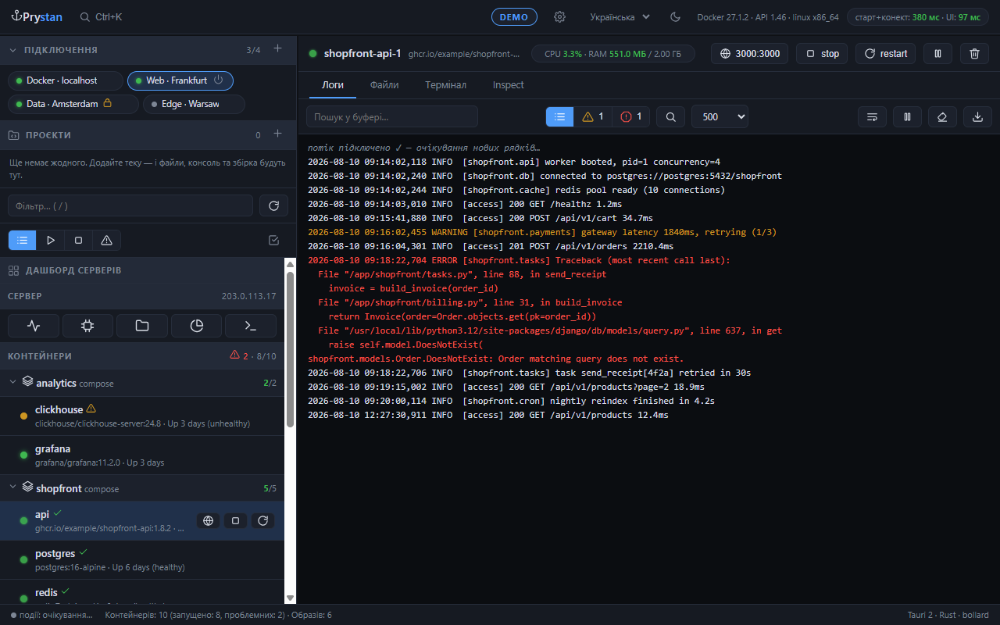
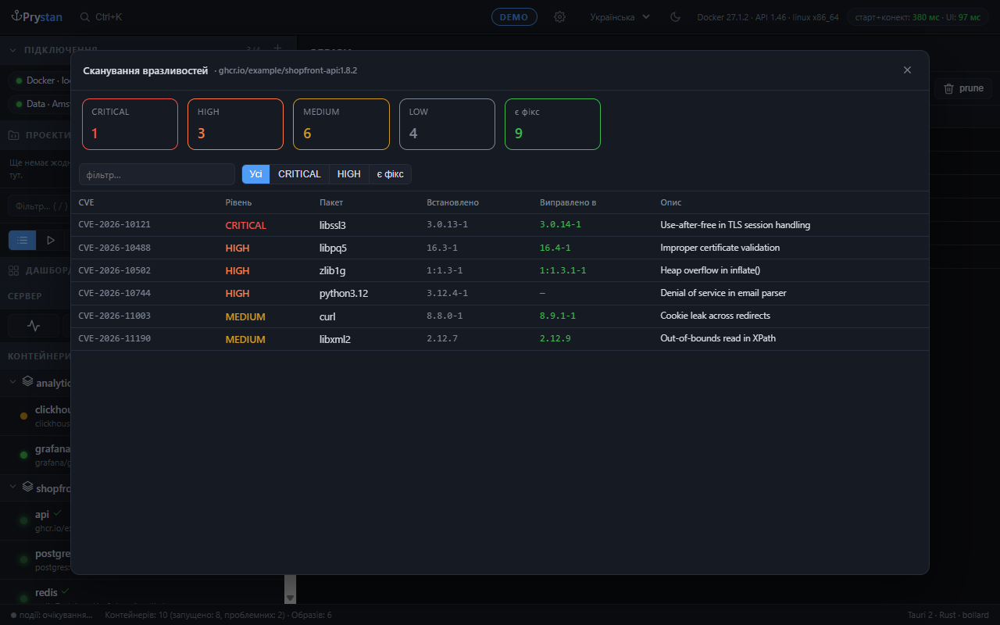
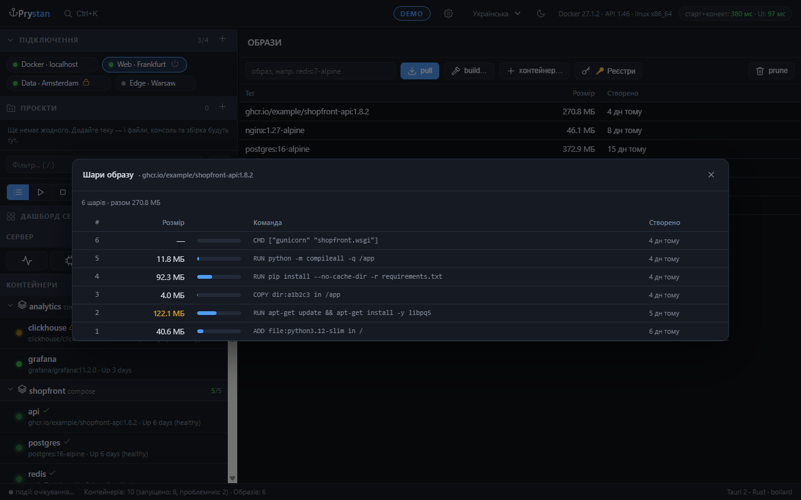
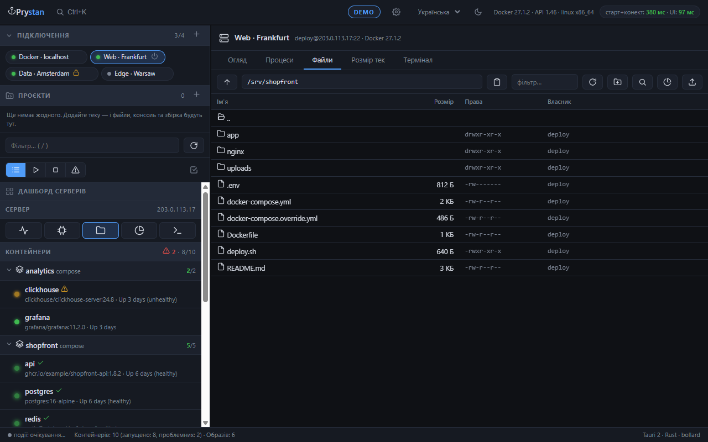

<div align="center">

# ⚓ Prystan

**Docker and your servers in one native window.**

A fast desktop client for managing Docker over local socket, TCP or SSH —
containers, logs, files, terminals, and the host machine itself.

[](LICENSE)
[](https://tauri.app)
[](https://www.rust-lang.org/)

🇺🇦 [Читати українською](README.uk.md)



</div>

---

## Why

Managing containers on several remote servers usually means one of three bad options:
SSH into each box and type `docker` commands by hand, install a web panel *onto* the
production server, or run Docker Desktop and give up 2 GB of RAM.

Prystan is a **13 MB binary that uses ~40 MB of RAM**, connects to any Docker daemon
over SSH without installing anything on the server, and puts logs, files, terminals
and host metrics into one window.

| | Prystan | Docker Desktop | Portainer | lazydocker |
|---|---|---|---|---|
| Install size | **13 MB** | ~1.5 GB | container | 30 MB |
| RAM idle | **~40 MB** | 1.5–2 GB | server-side | ~20 MB |
| Multi-server over SSH | **✅ built in** | ⚠️ contexts only | agents required | via `DOCKER_HOST` |
| Container file manager + editor | **✅** | basic | limited | ❌ |
| Host monitoring & processes | **✅** | ❌ | ❌ | ❌ |
| Full-history log search | **✅ server-side** | buffer only | buffer only | ❌ |
| Nothing installed on the server | **✅** | — | ❌ | ✅ |

## Features

**Connections** — local socket, TCP (with TLS), or SSH tunnel. Profiles reconnect
automatically on startup and recover from dropped links. Per-profile **read-only mode**
protects production from accidental changes.

**Containers** — compose-aware grouping, start/stop/restart/pause/kill, bulk actions,
health badges, quick filters (running / stopped / problematic), live CPU & RAM.

**Logs** — live streaming with error highlighting that understands **multi-line
tracebacks**, level filters, and **server-side search across the entire history**
(not just the visible buffer). Aggregated logs for a whole compose stack in one stream.

**Files** — browse, edit (syntax highlighting), upload, download, rename, chmod, and
drag-and-drop — inside containers *and* on the host filesystem. `.bak` copies on save.

**Terminals** — multiple sessions per target, PowerShell-style inline suggestions from
history, real `Tab` completion (with a client-side fallback for shells like `dash`
that have none), snippets, and a full host shell over SSH with working resize.

**Server** — live CPU/RAM/disk with sparklines, process list with kill, host file
manager and terminal. Metrics stream over a single persistent SSH session.

**Images & maintenance** — layer breakdown, vulnerability scanning via Trivy, disk
usage with prune, build from Dockerfile, private registries with push, container
recreation with edited environment variables, resource limits changed on the fly.

**Extras** — command palette (`Ctrl+K`), port forwarding with "open in browser",
action journal, Telegram alerts, light/dark themes, and Ukrainian / Russian / English UI.

<div align="center">

| Logs with error blocks | Vulnerability scan |
|---|---|
|  |  |

| Image layers | Host files over SSH |
|---|---|
|  |  |

</div>

## Download

Builds live on the **[Releases](../../releases)** page — open the latest release and
expand **Assets** at the bottom. Every archive is portable: unpack it and run the
binary, no installer and no runtime to set up.

| Your system | File to download |
|---|---|
| **Windows 10/11** — almost every PC | `Prystan-vX.Y.Z-Windows-x64.zip` |
| Windows on ARM — Surface Pro X, Dev Kit | `Prystan-vX.Y.Z-Windows-ARM64.zip` |
| Windows 32-bit — older machines | `Prystan-vX.Y.Z-Windows-32bit.zip` |
| **Mac with Apple Silicon** — M1 through M4 | `Prystan-vX.Y.Z-macOS-AppleSilicon.tar.gz` |
| Mac with Intel — before 2020 | `Prystan-vX.Y.Z-macOS-Intel.tar.gz` |
| **Linux, 64-bit** | `Prystan-vX.Y.Z-Linux-x64.tar.gz` |

If you are unsure, take **Windows-x64** — it fits almost everyone. The ARM build
simply will not start on a regular PC.

Not sure which Mac you have?  → *About This Mac*: a chip called M1/M2/M3/M4 means
Apple Silicon, anything saying Intel means the Intel build.

**After downloading**

- **Windows** needs [WebView2](https://developer.microsoft.com/microsoft-edge/webview2/) —
  bundled with Windows 11 and with up-to-date Windows 10.
- **macOS** builds are not signed. On first launch use `Ctrl`+click → *Open*, or run
  `xattr -dr com.apple.quarantine prystan`.
- **Linux** needs `libwebkit2gtk-4.1-0` and `libgtk-3-0`.

> Want a build of the very latest commit rather than a release? Open
> [Actions](../../actions), pick a green run and download the artifact for your
> platform. Those expire after 14 days.

## Build it yourself

Prerequisites:

- [Rust](https://rustup.rs/) (stable, MSVC toolchain on Windows)
- Visual Studio Build Tools with the **C++ workload** (Windows only)
- No Node.js, npm or bundler — the frontend is plain HTML/JS with vendored libraries

```bash
git clone https://github.com/YuraYarmola/prystan.git
cd prystan/app/src-tauri
cargo build --release
```

The binary lands in `app/src-tauri/target/release/prystan.exe`.

```bash
cargo test          # unit tests for parsers
cargo clippy        # lints
```

## Architecture

```
app/
  src-tauri/          Rust backend (Tauri 2)
    src/
      main.rs         connections, profiles, app state
      containers.rs   container list, actions, logs, stats
      logs.rs         history search, aggregated stack logs
      files.rs        container filesystem via archive API
      host.rs         SSH agent, monitor, host files, compose
      term.rs         container exec sessions
      forward.rs      SSH port forwarding
      resources.rs    images, volumes, networks, registries
      security.rs     Trivy vulnerability scanning
      journal.rs      local action log
      notify.rs       Telegram notifications
  ui/                 frontend — plain JS modules, no build step
    js/               core, conn, logs, files, term, server, resources, extras
    vendor/           xterm.js, CodeMirror (vendored, no CDN)
```

The backend talks to Docker through [bollard](https://github.com/fussybeaver/bollard)
(Engine API). SSH uses the system `ssh` client: a tunnel for the Docker socket, one
persistent agent process for file operations, and ConPTY for interactive terminals.

## Documentation

- [Contributing guide](CONTRIBUTING.md)
- [Security policy](SECURITY.md)
- [Changelog](CHANGELOG.md)

## Contributing

Contributions are welcome — issues, bug reports and pull requests. Every change is
reviewed by the project owner before it lands. Please read [CONTRIBUTING.md](CONTRIBUTING.md)
first; contributions require agreeing to the [CLA](CLA.md).

## License

Prystan is licensed under the **GNU Affero General Public License v3.0** — see [LICENSE](LICENSE).

In short: you may use, study, modify and share it freely, but if you distribute a
modified version or run it as a network service, your changes must be published under
the same license.

Copyright © 2026 Yurii Yarmola. Contributors keep the copyright to their own
contributions and license them to the project under the [CLA](CLA.md), which lets the
project owner also offer Prystan under other terms.
