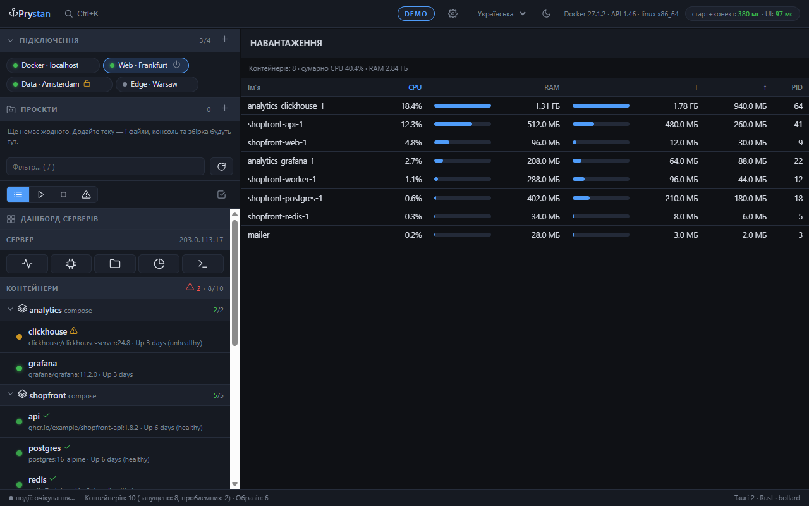
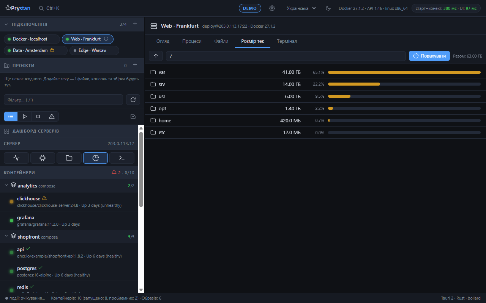
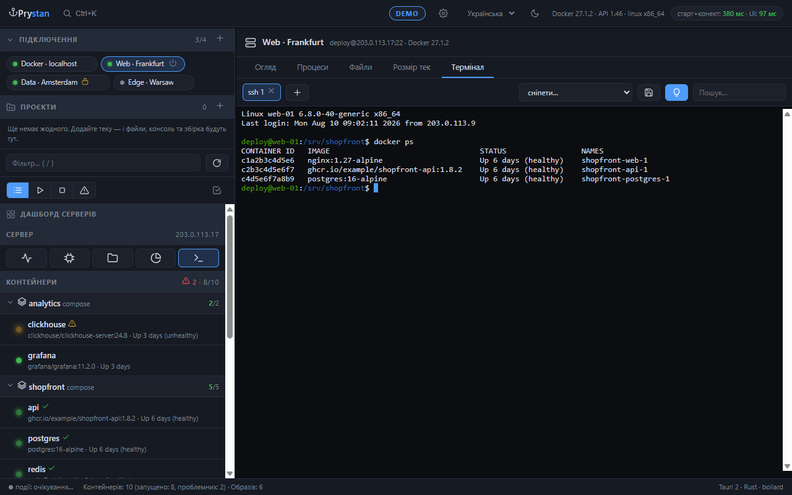
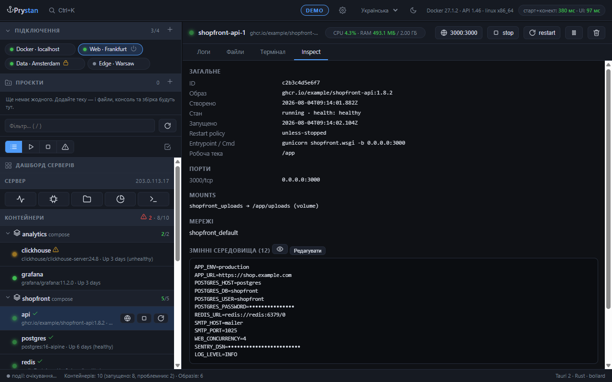
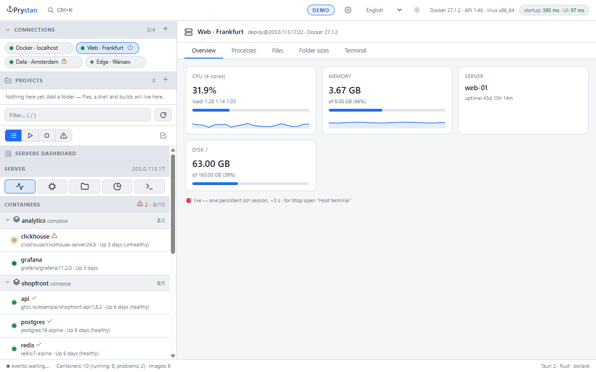

<div align="center">

# ⚓ Prystan

**Docker і ваші сервери в одному нативному вікні.**

Швидкий десктопний клієнт для Docker через локальний сокет, TCP або SSH —
контейнери, логи, файли, термінали й сама хост-машина.

[](LICENSE)
[](https://tauri.app)

[Read in English](README.md)


*Усі знімки в цьому README зроблені у вбудованому **демо-режимі** — сервери,
контейнери та адреси на них вигадані.*

</div>

---

## Навіщо

Керувати контейнерами на кількох серверах зазвичай можна трьома незручними способами:
заходити по SSH на кожен і набирати `docker` руками, ставити веб-панель **на сам прод**,
або запускати Docker Desktop і віддавати йому 2 ГБ пам'яті.

Prystan — це **бінарник на 13 МБ, що займає ~40 МБ RAM**, підключається до будь-якого
Docker-демона по SSH **нічого не встановлюючи на сервер**, і збирає логи, файли,
термінали й метрики хоста в одному вікні.

<div align="center">

| Логи з підсвіткою помилки цілком | Навантаження по всіх контейнерах |
|---|---|
|  |  |

| Файли хоста по SSH | Розмір тек |
|---|---|
|  |  |

</div>

## Завантаження

Збірки лежать на сторінці **[Releases](../../releases)** — відкрийте останній реліз
і розгорніть **Assets** унизу. Усі архіви портативні: розпакували й запустили,
інсталятор і жодні рантайми не потрібні.

| Ваша система | Який файл качати |
|---|---|
| **Windows 10/11** — майже всі ПК | `Prystan-vX.Y.Z-Windows-x64.zip` |
| Windows на ARM — Surface Pro X, Dev Kit | `Prystan-vX.Y.Z-Windows-ARM64.zip` |
| Windows 32-біт — старі машини | `Prystan-vX.Y.Z-Windows-32bit.zip` |
| **Mac на Apple Silicon** — M1…M4 | `Prystan-vX.Y.Z-macOS-AppleSilicon.tar.gz` |
| Mac на Intel — до 2020 року | `Prystan-vX.Y.Z-macOS-Intel.tar.gz` |
| **Linux, 64-біт** | `Prystan-vX.Y.Z-Linux-x64.tar.gz` |

Якщо не впевнені — беріть **Windows-x64**, він підходить майже всім. ARM-версія на
звичайному ПК просто не запуститься.

**Після завантаження**

- **Windows** потребує [WebView2](https://developer.microsoft.com/microsoft-edge/webview2/) —
  є в Windows 11 і в оновленій Windows 10.
- **macOS**: збірки не підписані. При першому запуску `Ctrl`+клік → «Відкрити»,
  або `xattr -dr com.apple.quarantine prystan`.
- **Linux**: потрібні `libwebkit2gtk-4.1-0` і `libgtk-3-0`.

> Потрібна збірка найсвіжішого коміту, а не релізу? Відкрийте
> [Actions](../../actions), виберіть зелений запуск і завантажте артефакт під свою
> платформу. Вони зберігаються 14 днів.

---

# Інструкція

Усі можливості: що це, як увімкнути й як цим користуватися.

## Спробувати без Docker — демо-режим

Відкрийте **⚙ → Демо-режим** — застосунок перезапуститься на вигаданих серверах,
контейнерах, логах і файлах. Нічого не чіпає ні вашу машину, ні вашу інфраструктуру.
Зручно роздивитись усе до того, як щось підключати, або зробити знімок екрана, не
світячи власні хости. Про режим нагадує позначка **DEMO** у шапці; вимикається там
само.

## Підключення

**Як налаштувати.** **＋** біля розділу *ПІДКЛЮЧЕННЯ* або картка *Сервер по SSH* на
стартовому екрані.

| Тип | Що вказати |
|---|---|
| **Локальний** | нічого — використовується локальний сокет або named pipe |
| **SSH** | хост, порт, користувач, за потреби шлях до приватного ключа |
| **TCP** | хост і порт демона (`2375`, або `2376` з TLS) |

Для SSH на сервері не треба ні агента, ні додаткового софту: тунель піднімає ваш
власний клієнт `ssh`. Тому працює все, що працює у вашому терміналі, — і ключі з
агента, і налаштування з `~/.ssh/config`.

**Як користуватися.** Клік по чипу перемикає сервер, іконка живлення підключає або
відключає. Ручне відключення запам'ятовується — саме воно вже не підніметься. Решта
відновлюється на старті й після обриву, з наростаючою паузою між спробами.

**Read-only** у профілі забороняє всі змінюючі дії для цього сервера. Гарно лягає на
прод: перегляд, логи й файли лишаються, а кнопки, що щось міняють, — ні.

**Імпорт** підтягує наявні `docker context` і перетворює їх на профілі.

## Контейнери

**Як користуватися.** Список групується по compose-проєктах. Групу можна запустити,
зупинити або відкрити як стек; окремий контейнер дає логи, консоль, файли й inspect.

- **Правий клік** по контейнеру чи стеку — повне меню: логи, консоль, файли, inspect,
  старт/стоп/рестарт, копіювати назву або ID, видалити.
- **Фільтр** (`/`) шукає за назвою, образом, проєктом, **портом**, ID і текстом
  статусу: наберіть `8080`, щоб знайти, хто зайняв порт, або `exited` — щоб побачити,
  що впало.
- **Швидкі фільтри** в панелі: усі, запущені, зупинені, проблемні.
- **Режим вибору** (іконка з галочкою) дозволяє позначити кілька контейнерів і
  застосувати одну дію до всіх.
- **Клавіатура**: `↑`/`↓` ходять списком, `Enter` відкриває, `←`/`→` згортають стек,
  `Del` видаляє, `Пробіл` позначає для масової дії.

**Індикатори.** Кружечок показує стан з одного погляду: healthy пульсує зеленим,
unhealthy але робочий — жовтим, зупинене світиться рівним сірим. Контейнер, що впав
тричі за десять хвилин, отримує позначку циклу перезапуску.

**Порти.** Клікається кожен опублікований порт — якщо їх кілька, кнопка відкриває
список. Для SSH-сервера застосунок спершу підіймає тунель, тож `localhost` у браузері
потрапляє на віддалений порт.

## Навантаження

Розділ **НАВАНТАЖЕННЯ** — одна таблиця по всіх запущених контейнерах: CPU, пам'ять,
мережа туди й назад, кількість процесів. Клік по заголовку сортує: відповідь на
питання «хто зʼїв сервер» видно одразу, без перебирання контейнерів. Таблиця
оновлюється сама, поки відкрита; клік по рядку відкриває контейнер.

## Логи

**Як користуватися.** Вкладка логів стрімить наживо й сама перепідключається.

- **Підсвітка помилок розуміє блоки цілком** — traceback Python чи стек Java
  фарбується від першого рядка до останнього, а не лише той рядок, де є слово
  `ERROR`.
- **Фільтр за рівнем** із лічильниками, які рахують випадки, а не рядки.
- **Пошук у буфері** ховає зайве просто під час набору.
- **🔍 Пошук по всій історії** питає сервер, а не буфер: звичайний текст або
  регулярний вираз по всьому, що контейнер колись написав, за потреби з обмеженням
  за часом.
- **Правий клік** дає скопіювати виділене, рядок, **помилку цілком** або весь буфер,
  а також експорт у файл.
- **Стежити** тримає вигляд на кінці; прокрутка вгору звільняє, кнопка повертає.
- У compose-стека є **зведені логи** — усі сервіси в одному потоці, кожен своїм
  кольором.

**Що налаштувати.** Глибина історії (500 / 2000 / 10000) — у панелі логів, розмір
буфера в пам'яті — у **⚙ → Буфер логів**.

## Файли

Однаково працює для контейнера, сервера по SSH і теки локального проєкту.

**Як користуватися.** Подвійний клік відкриває теку або файл. Поле шляху редаговане —
вставте шлях і натисніть `Enter`. Файли можна перетягнути у вікно з провідника.

**Правий клік будь-де в панелі** — і по рядку, і по порожньому місцю — дає відкрити,
завантажити, копіювати, вирізати, вставити, перейменувати, перемістити, права,
копіювати шлях, новий файл, нову теку, аналіз розміру й видалення. З клавіатури те
саме роблять `Ctrl+C` / `Ctrl+X` / `Ctrl+V`, `F2`, `Del` і `Backspace`.

**Редактор.** Підсвітка синтаксису, пошук у файлі й копія `.bak` при збереженні
(галочка внизу). **⚙ → Редактор збоку** пришвартовує його до правої половини вікна,
тож логи лишаються видимі під час правок.

**Пошук** (лупа в панелі) іде рекурсивно вглиб теки — за іменем файлу або за текстом
усередині файлів, і переходить до знайденого.

**Розмір тек** (іконка діаграми) відповідає на питання «що забило диск»: один рівень
углиб зі смужками, клік по теці провалюється далі.

## Термінали

**Як користуватися.** Кілька сесій на контейнер або сервер, у вкладках. Для
контейнера шелл обирається в панелі (`bash`, `sh`, `ash`, `zsh`), типовий — у
**⚙ → Shell**.

- **`Tab`** доповнює шляхи — навіть у шелах на кшталт `dash`, де доповнення немає
  зовсім: там його робить сам застосунок.
- **Підказки з історії** з'являються приглушеним текстом праворуч від курсора, як у
  PowerShell; `→` або `End` приймає. Кнопка 💡 їх вимикає.
- **`Ctrl+C`** копіює, коли є виділення, і лишається сигналом перервати, коли його
  немає. **`Ctrl+V`** вставляє. Правий клік дає копіювати / вставити / виділити все /
  очистити екран.
- **Сніпети**: збережіть поточну команду кнопкою 💾 і потім беріть її з випадайки.
- Консоль хоста працює через справжній PTY, тож ресайз діє, а `sudo` може спитати
  пароль.



## Сервер

Доступно для SSH-підключень.

- **Огляд** — CPU, пам'ять і диски зі спарклайнами, load average, uptime. Усе йде
  однією постійною ssh-сесією, а не командою щосекунди.
- **Процеси** — живий список із фільтром і сортуванням за CPU чи пам'яттю, кнопка
  kill шле спершу `TERM`, а на друге натискання `KILL`.
- **Файли** й **Розмір тек** — те саме, що описано вище, на файловій системі хоста.
- **Термінал** — повноцінний shell.
- **Дашборд серверів** показує всі налаштовані сервери на одному екрані.

## Локальні проєкти

Для теки, у якій ви власне працюєте.

**Як налаштувати.** **＋** біля розділу *ПРОЄКТИ* → вкажіть шлях до теки на своїй
машині.

**Як користуватися.** Проєкт дає файли з редактором, **консоль, відкриту просто в цій
теці**, `compose up / build / down / restart / pull` локальним `docker` і аналіз
розміру тек. Позначки в шапці показують, що знайдено в теці: compose-файл,
Dockerfile, git.

Read-only на прод-профілі проєктів не стосується — це ваші власні файли, і до сервера
вони відношення не мають.

## Образи й обслуговування

- **Шари** — розмір кожного шару й команда, яка його створила: видно, чим саме
  роздутий образ.
- **Сканування вразливостей** — Trivy запускається в одноразовому контейнері, нічого
  не залишає хост; результат фільтрується за критичністю і за наявністю виправлення.
- **Використання диска** з prune по категоріях: образи, контейнери, томи, кеш збірки.
- **Build** із Dockerfile, **pull**, **створення контейнера** через форму, яка одразу
  показує еквівалентний `docker run`.
- **Реєстри**: облікові дані лягають у системне сховище, після чого `push` доступний
  зі списку образів.
- **Змінні оточення** редагуються у вкладці Inspect так само, як у плагіні JetBrains:
  контейнер перестворюється з новими значеннями, а якщо щось піде не так — старий
  повертається. Секрети приховані, доки їх не відкрити.
- **Ліміти CPU і пам'яті** змінюються без перестворення контейнера.

| Шари образу | Сканування вразливостей | Inspect і змінні оточення |
|---|---|---|
|  |  |  |

## Проброс портів

Глобус біля запущеного контейнера підіймає ssh-тунель до опублікованого порту й
відкриває адресу в браузері. Позначка 🔌 у шапці рахує відкриті тунелі, клік по ній
закриває всі.

## Сповіщення

**Як налаштувати.** **⚙ → Telegram**: вставте токен бота з
[@BotFather](https://t.me/BotFather) і натисніть **Знайти чат** — далі напишіть боту
будь-що, і `chat_id` підставиться сам. **Надіслати тест** перевіряє, що все працює.

**Оберіть, що саме слати** — кожен тип окремо:

| Подія | Коли спрацьовує |
|---|---|
| Контейнер несподівано зупинився | він упав, і зупиняли його **не ви**; у повідомленні є код виходу, а `137` окремо позначається як можливий OOM |
| CPU, пам'ять або диск за порогом | вище 95 % / 92 % / 90 %, не частіше разу на десять хвилин |
| Втрачено зʼєднання із сервером | обірвався потік подій |
| Завершено compose-дію | закінчились `up`, `down`, `build`, `restart` |

**Алерти охоплюють усі підключені сервери, а не лише відкритий.** Фонові хости
опитуються рідшим інтервалом — **⚙ → Фоновий моніторинг**, там же його можна
вимкнути.

## Журнал дій

Розділ **ЖУРНАЛ** записує, що робив застосунок: яка дія, на якому сервері, з яким
результатом. Стає в пригоді, коли треба згадати, що саме перезапускали годину тому.
Зберігається локально, очищається кнопкою.

## Налаштування

**⚙** у шапці:

| Налаштування | На що впливає |
|---|---|
| Оновлення списку | як часто опитується список контейнерів (2 / 4 / 10 с або вимкнути) |
| Фоновий моніторинг | інтервал для серверів, які зараз не на екрані (потрібен для порогових алертів) |
| Буфер логів | скільки рядків тримати в пам'яті |
| Shell | типовий шелл для консолі контейнерів |
| Питати підтвердження | діалоги перед видаленням |
| Редактор збоку | пришвартувати редактор замість перекривати вікно |
| Перевіряти оновлення | один запит до GitHub Releases на старті |
| Демо-режим | вигадані дані замість справжніх |

**Тема** (місяць/сонце) і **мова** (uk / ru / en) — поруч із шестернею.



## Гарячі клавіші

Натисніть **`?`** у застосунку, щоб побачити цей список.

| Клавіші | Дія |
|---|---|
| `Ctrl+K` | командна палітра — перехід до будь-якого контейнера, стека, сервера чи дії |
| `/` | фокус у фільтр |
| `↑` `↓` · `Enter` | рух списком і відкриття |
| `←` `→` | згорнути або розгорнути стек |
| `Ctrl+R` | оновити все |
| `Del` | видалити вибране |
| `F2` | перейменувати файл |
| `Ctrl+C` / `Ctrl+V` | копіювати та вставити |
| `Ctrl+Shift+A` | виділити все в терміналі |
| `Backspace` | на теку вище |
| `Esc` | закрити вікно або меню |
| `?` | цей список |

## Де що зберігається

| Що | Windows | macOS | Linux |
|---|---|---|---|
| Профілі, проєкти, журнал | `%APPDATA%\Prystan` | `~/Library/Application Support/Prystan` | `~/.config/prystan` |
| Токени реєстрів і Telegram | Credential Manager | Keychain | Secret Service |
| Налаштування інтерфейсу | локальне сховище всередині застосунку | | |

Паролі й токени у файли конфігурації не потрапляють.

---

## Збірка з коду

Потрібні [Rust](https://rustup.rs/) (stable, MSVC) і Visual Studio Build Tools з
C++ workload. **Node.js не потрібен** — фронтенд це звичайний HTML/JS.

```bash
git clone https://github.com/YuraYarmola/prystan.git
cd prystan/app/src-tauri
cargo build --release
```

## Документація

- [Як контриб'ютити](CONTRIBUTING.md)
- [Політика безпеки](SECURITY.md)
- [Список змін](CHANGELOG.md)

## Ліцензія

**GNU AGPL v3.0** — див. [LICENSE](LICENSE). Коротко: можна вільно користуватись,
вивчати, змінювати й поширювати, але якщо ви розповсюджуєте змінену версію або
запускаєте її як мережевий сервіс — ваші зміни мають бути опубліковані під тією ж
ліцензією.

© 2026 Юрій Ярмола. Контриб'ютори зберігають авторське право на свої внески й
ліцензують їх проєкту через [CLA](CLA.md).
